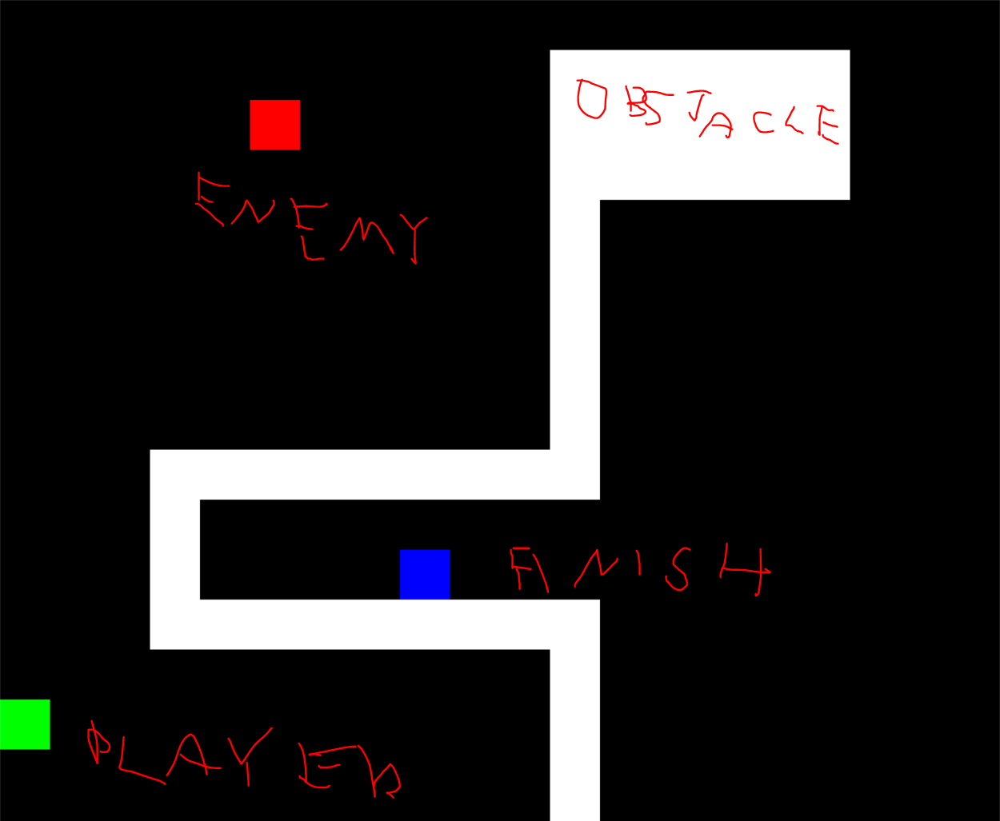

# Compilation

Windows:

Download and install MSYS2, add bin to System Path
Manual compilation:

```
g++ .\src\game.cpp -IC:\msys64\mingw64\include -lmingw32 -mwindows -lSDL2main -lSDL2 -lopengl32 -pthread
```

Linux:

```
git clone https://github.com/libsdl-org/SDL
cd SDL
mkdir build
cd build
cmake .. -DCMAKE_BUILD_TYPE=Release
cmake --build . --config Release --parallel

#CMake >= 3.15
sudo cmake --install . --config Release

#CMake <= 3.14
sudo make install
```

# Map options
game is based on map at data/map.txt

you can modify X finish point location by setting it, means X elsewhere, also setting blank as 0 means cell is empty or 1 is obstacle

you can also create bigger map but keep x to y as 1 : 1, currently map has 20 x 20 cells, also window size is 1000 pixels, it scales itself

```
0,0,0,0,0,0,0,0,0,0,0,0,0,0,0,0,0,0,0,0,
0,0,0,0,0,0,0,0,0,0,0,1,1,1,1,1,1,0,0,0,
0,0,0,0,0,E,0,0,0,0,0,1,1,1,1,1,1,0,0,0,
0,0,0,0,0,0,0,0,0,0,0,1,1,1,1,1,1,0,0,0,
0,0,0,0,0,0,0,0,0,0,0,1,0,0,0,0,0,0,0,0,
0,0,0,0,0,0,0,0,0,0,0,1,0,0,0,0,0,0,0,0,
0,0,0,0,0,0,0,0,0,0,0,1,0,0,0,0,0,0,0,0,
0,0,0,0,0,0,0,0,0,0,0,1,0,0,0,0,0,0,0,0,
0,0,0,0,0,0,0,0,0,0,0,1,0,0,0,0,0,0,0,0,
0,0,0,1,1,1,1,1,1,1,1,1,0,0,0,0,0,0,0,0,
0,0,0,1,0,0,0,0,0,0,0,0,0,0,0,0,0,0,0,0,
0,0,0,1,0,0,X,0,0,0,0,0,0,0,0,0,0,0,0,0,
0,0,0,1,1,1,1,1,1,1,1,1,0,0,0,0,0,0,0,0,
0,0,0,0,0,0,0,0,0,0,0,1,0,0,0,0,0,0,0,0,
S,0,0,0,0,0,0,0,0,0,0,1,0,0,0,0,0,0,0,0,
0,0,0,0,0,0,0,0,0,0,0,1,0,0,0,0,0,0,0,0,
0,0,0,0,0,0,0,0,0,0,0,1,0,0,0,0,0,0,0,0,
0,0,0,0,0,0,0,0,0,0,0,1,0,0,0,0,0,0,0,0,
0,0,0,0,0,0,0,0,0,0,0,1,1,1,1,1,1,1,0,0,
0,0,0,0,0,0,0,0,0,0,0,0,0,0,0,0,0,0,0,0,
```

# How to run
double click a.exe
or build/game.exe

# How to play
Esc - end game

r - restart, when you get to blue point

arrow up - up

arrow down - down

arrow left - left

arrow right - right



